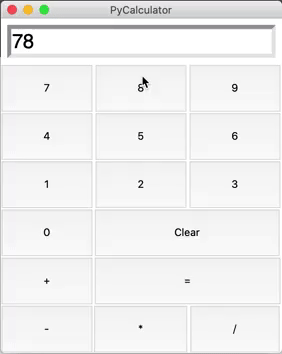
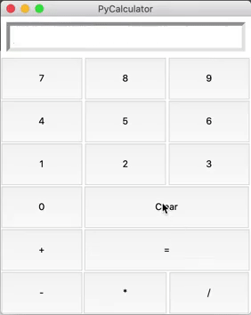
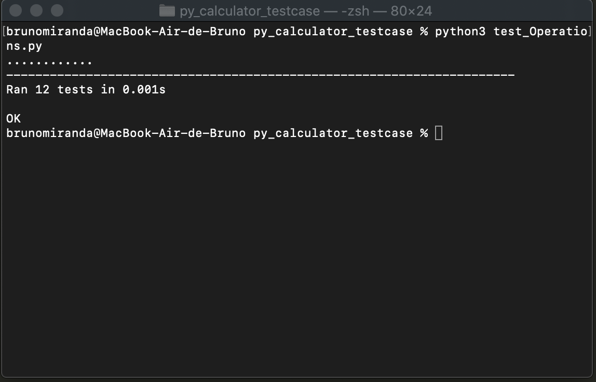

# Python Calculator Unittesting  
## Objective
Create a calculator app using Python‘s Tkinter library and OOP as for learning the basics of building a GUI with this very library, Object Oriented, and also basic functions of Python's Unittest library.

## Project Features
The app presents the four basic operations and also buttons to show the result and clear the display:

The result of previous calculations can also be used for new ones:

Some basic tests of the class responsible for the mathematical operations were also ran using Python's Unittest library:

